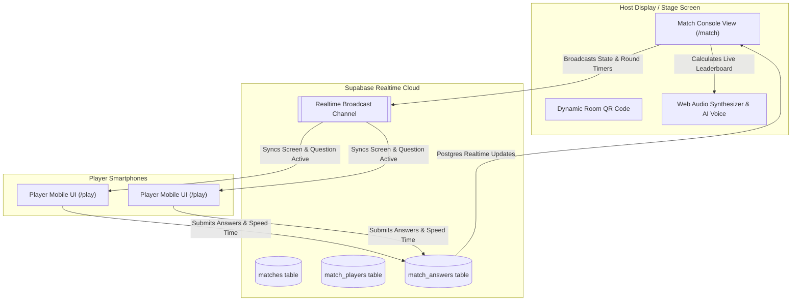

<div align="center">

# ⚔️ IAE AI-BATTLEGROUND ⚔️

### *Synchronous Real-Time Expo Booth & Event Trivia Platform*

[](https://react.dev/)
[](https://vitejs.dev/)
[](https://supabase.com/)
[](https://developer.mozilla.org/en-US/docs/Web/API/Web_Audio_API)
[](#license)

<p align="center">
  <b>A high-octane, interactive multi-player trivia game designed for tech expos, keynotes, and live events. Players join instantly on mobile via QR code to battle against clock skew and compete live on the stage host display!</b>
</p>

[🎮 Features](#-key-features) •
[🕹️ Game Rounds](#️-game-rounds--mechanics) •
[🏗️ Architecture](#%EF%B8%8F-system-architecture) •
[🚀 Quick Start](#-quick-start) •
[🗄️ Database Schema](#%EF%B8%8F-supabase-database-setup) •
[🔊 Sound Engine](#-synthesized-web-audio--ai-voice)

---

</div>

## 🌟 Overview

**AI-DEATH ARENA** transforms traditional trivia into an adrenaline-fueled arena experience. Built specifically for high-footfall environments like conference booths and hackathons, it allows hundreds of attendees to join seamless real-time rounds using their smartphones with **zero app installation required**.

With custom **Web Audio API sound synthesis**, an **AI Speech host voice**, **latency-compensated sub-millisecond clock synchronization**, and an interactive **Live Host Console**, AI-Death Arena delivers a gaming experience for live crowds.

---

## ⚡ Key Features

- 📱 **Instant QR Code Join**: Attendees scan the Host stage screen with their phone camera and jump straight into the lobby.
- ⚡ **Sub-Millisecond Clock Sync**: Built-in latency estimation using HTTP Date headers guarantees fair, synchronized timers across all player devices regardless of local system clock drift.
- 🔊 **100% Code-Synthesized Web Audio & AI Host**: Synthesizes real-time sound effects (chimes, dynamic crescendo drumrolls, bandpass noise audience applause, urgency ticks) and AI voice countdowns without fetching heavy MP3 assets.
- 🎮 **Stage Host Console (`/match`)**: High-impact spectator dashboard featuring animated backgrounds, live player counts, real-time leaderboard ranks, and instant confetti animations.
- 📱 **Mobile-First Player View (`/play`)**: Responsive, touch-optimized gaming interface with avatar customization, streak multipliers, speed bonus calculations, and instant visual/haptic feedback.
- 🏆 **Hall of Fame Leaderboard (`/leaderboard`)**: Global podium and rankings displaying top arena champions, streak records, and round stats.
- ⚙️ **PIN-Gated Admin Dashboard (`/admin`)**: Secure host control center protected by a 4-digit Host PIN (`2004`) to add, edit, or toggle questions, and perform data resets.

---

## 🕹️ Game Rounds & Mechanics

AI-Death Arena tests players' AI literacy across **3 distinct battle rounds**:

| Round | Name | Description | Mechanics |
| :--- | :--- | :--- | :--- |
| **Round 1** | **AI vs Real Image Battle** 🖼️ | Compare side-by-side images to spot which image was synthesized by AI. | Dual-image comparison cards with high-res visual indicators. |
| **Round 2** | **AI Brand & Logo MCQ** 🎨 | Identify modified AI tool logos, tech icons, and brand variations. | 4-Option Multiple Choice with visual logo prompts. |
| **Round 3** | **AI Emoji Puzzle Decoder** 🧩 | Decipher AI models, algorithms, and concepts encoded into emoji riddles. | Fast-paced 4-Option MCQ emoji riddles. |

### 🧮 Scoring System Math

Points are awarded dynamically based on accuracy, response speed, and consecutive streak multipliers:

$$ \text{Total Points} = \left( \text{Base Points} + \text{Speed Bonus} \right) \times \text{Streak Multiplier} $$

- **Base Points**: `1,000` points per correct answer.
- **Speed Bonus**: Up to `500` additional points based on response speed:
  $$ \text{Speed Bonus} = \max\left(0, \left(1 - \frac{\text{Response Time (ms)}}{\text{Round Time Limit (ms)}}\right) \times 500\right) $$
- **Streak Multiplier**: Consecutive correct answers stack streak multipliers up to **3.0x**!

---

## 🏗️ System Architecture



---

## 🛠️ Tech Stack & Ecosystem

| Layer | Technology | Purpose |
| :--- | :--- | :--- |
| **Frontend Framework** | [React 19](https://react.dev/) | High-performance component-driven UI architecture. |
| **Build Tooling** | [Vite 8](https://vitejs.dev/) | Lightning-fast HMR and bundle compilation. |
| **Routing** | [React Router v7](https://reactrouter.com/) | Client-side routing across Arena views. |
| **Backend & Realtime** | [Supabase](https://supabase.com/) | PostgreSQL database, WebSockets realtime subscriptions, and clock HTTP sync. |
| **Icons & Utility** | [Lucide React](https://lucide.dev/) | Modern icon set for game UI controls. |
| **Effects & QR** | `canvas-confetti` & `qrcode.react` | Victorious fanfare confetti bursts and room QR generation. |
| **Linter** | [Oxlint](https://oxc.rs/) | High-speed JavaScript/JSX code linting. |

---

## 📁 Workspace Structure

```
AI-Death-Arena/
├── public/
│   ├── arena_bg.png              # Custom high-res arena backdrop
│   ├── favicon.svg               # Arena favicon emblem
│   └── images/                   # Question asset image bank
│       ├── round1/               # Real vs AI image comparison sets
│       └── round2/               # AI tech logo SVG assets
├── src/
│   ├── assets/                   # Visual styles and static resources
│   ├── components/
│   │   ├── ArenaBackground.jsx   # Animated glow and glassmorphic backdrop
│   │   ├── ArenaBackground.css   # Keyframe aura animations & styling
│   │   └── EmojiRain.jsx         # Victory celebratory emoji particles
│   ├── lib/
│   │   ├── audioManager.js       # Web Audio API Synthesizer & Speech AI engine
│   │   ├── serverClock.js        # Sub-millisecond server clock offset sync
│   │   ├── supabase.js           # Supabase client connection instance
│   │   └── avatar.js             # Player avatar selector helper
│   ├── pages/
│   │   ├── HomeView.jsx          # Entry landing page & mode launcher
│   │   ├── MatchConsoleView.jsx  # Stage Host controller & live arena display
│   │   ├── PlayerView.jsx        # Mobile player game console & answer responder
│   │   ├── LeaderboardView.jsx   # Global Hall of Fame leaderboard podium
│   │   └── AdminView.jsx         # PIN-gated question bank & system manager
│   ├── App.jsx                   # Application router & env validator
│   ├── main.jsx                  # React DOM entrypoint
│   └── index.css                 # Global CSS design tokens & animations
├── .env                          # Supabase API keys & config
├── package.json                  # Dependencies and scripts
└── vite.config.js                # Vite build options
```

---

## 🚀 Quick Start

### 1. Prerequisites

Ensure you have **Node.js 18+** and **npm** installed on your system.

### 2. Clone Repository & Install Dependencies

```bash
git clone https://github.com/NiketaTembhare/AI-Death-Arena.git
cd AI-Death-Arena
npm install
```

### 3. Setup Environment Variables

Create a `.env` file in the root directory:

```env
VITE_SUPABASE_URL=https://your-supabase-project-id.supabase.co
VITE_SUPABASE_ANON_KEY=your-supabase-anon-key
```

### 4. Launch Development Server

```bash
npm run dev
```

Open `http://localhost:5173` in your browser to start!

---

## 🗄️ Supabase Database Setup

Run the following SQL DDL scripts inside your **Supabase SQL Editor** to create the required tables and real-time subscriptions:

```sql
-- 1. Question Bank Table
CREATE TABLE IF NOT EXISTS questions (
  id UUID PRIMARY KEY DEFAULT gen_random_uuid(),
  round INT NOT NULL,
  question_type VARCHAR(50) NOT NULL,
  prompt_text TEXT NOT NULL,
  real_image_url TEXT,
  ai_image_url TEXT,
  logo_url TEXT,
  options JSONB,
  correct_option TEXT NOT NULL,
  explanation TEXT,
  is_active BOOLEAN DEFAULT true,
  created_at TIMESTAMPTZ DEFAULT NOW()
);

-- 2. Match Sessions Table
CREATE TABLE IF NOT EXISTS matches (
  id UUID PRIMARY KEY DEFAULT gen_random_uuid(),
  access_code VARCHAR(10) UNIQUE NOT NULL,
  status VARCHAR(30) DEFAULT 'lobby',
  current_round INT DEFAULT 1,
  max_rounds INT DEFAULT 3,
  time_limit_sec INT DEFAULT 15,
  current_question_id UUID REFERENCES questions(id),
  question_start_time TIMESTAMPTZ,
  created_at TIMESTAMPTZ DEFAULT NOW()
);

-- 3. Match Players Table
CREATE TABLE IF NOT EXISTS match_players (
  id UUID PRIMARY KEY DEFAULT gen_random_uuid(),
  match_id UUID REFERENCES matches(id) ON DELETE CASCADE,
  nickname VARCHAR(50) NOT NULL,
  avatar VARCHAR(50) DEFAULT '⚡',
  score INT DEFAULT 0,
  streak INT DEFAULT 0,
  correct_answers INT DEFAULT 0,
  total_time_ms INT DEFAULT 0,
  has_left BOOLEAN DEFAULT false,
  joined_at TIMESTAMPTZ DEFAULT NOW()
);

-- 4. Match Round Questions Sequence Table
CREATE TABLE IF NOT EXISTS match_round_questions (
  id UUID PRIMARY KEY DEFAULT gen_random_uuid(),
  match_id UUID REFERENCES matches(id) ON DELETE CASCADE,
  round INT NOT NULL,
  question_id UUID REFERENCES questions(id) ON DELETE CASCADE,
  order_index INT NOT NULL
);

-- 5. Match Answers Submission Table
CREATE TABLE IF NOT EXISTS match_answers (
  id UUID PRIMARY KEY DEFAULT gen_random_uuid(),
  match_id UUID REFERENCES matches(id) ON DELETE CASCADE,
  player_id UUID REFERENCES match_players(id) ON DELETE CASCADE,
  question_id UUID REFERENCES questions(id) ON DELETE CASCADE,
  selected_option TEXT NOT NULL,
  response_time_ms INT NOT NULL,
  is_correct BOOLEAN NOT NULL,
  points_earned INT DEFAULT 0,
  streak INT DEFAULT 0,
  created_at TIMESTAMPTZ DEFAULT NOW()
);

-- Enable Supabase Realtime safely for instant synchronization
DO $$
BEGIN
  IF NOT EXISTS (SELECT 1 FROM pg_publication_tables WHERE pubname = 'supabase_realtime' AND tablename = 'matches') THEN
    ALTER PUBLICATION supabase_realtime ADD TABLE matches;
  END IF;

  IF NOT EXISTS (SELECT 1 FROM pg_publication_tables WHERE pubname = 'supabase_realtime' AND tablename = 'match_players') THEN
    ALTER PUBLICATION supabase_realtime ADD TABLE match_players;
  END IF;

  IF NOT EXISTS (SELECT 1 FROM pg_publication_tables WHERE pubname = 'supabase_realtime' AND tablename = 'match_answers') THEN
    ALTER PUBLICATION supabase_realtime ADD TABLE match_answers;
  END IF;
END $$;
```

---

## 🔊 Synthesized Web Audio & AI Voice

AI-Death Arena features a zero-asset procedural audio engine built on the browser's native **Web Audio API** and **Web Speech API**:

- 🔊 **Dynamic Crescendo Drumroll**: Synthesizes exponential white-noise bandpass pulses accelerating up to a bass kick impact for round reveals.
- 👏 **Crowd Applause**: Simulates multi-source palm clapping using randomized bandpass-filtered noise bursts (1000Hz - 2800Hz).
- ⏱️ **Urgency Ticks**: Rising pitch frequency pulses during the final 5 seconds of round countdowns.
- 🗣️ **AI Host Voice**: Native SpeechSynthesis engine announces countdowns ("Three!", "Two!", "One!", "Go!") and match events dynamically.

---

## 🔐 Admin Console & Security

- **Host Access PIN**: Accessing `/admin` requires entering host PIN **`2004`**.
- **Data Wipeout Safeguard**: To prevent accidental data loss, wiping past matches and leaderboard scores requires explicitly typing **`RESET`** in all caps.

---

## 📜 License

Distributed under the **MIT License**. See `LICENSE` for details.

---

<div align="center">

Made with ❤️ for high-energy tech events & live crowds.

**[⬆ Back to Top](#️-ai-death-arena-️)**

</div>
